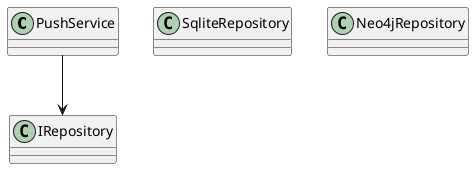

# Instant Sync Add-in

This project implements a delta-based push/pull synchronization for Revit models with a Neo4j graph database. The source is located in `src/InstantSync` and tests in `tests/InstantSync.Tests`.

## Build Setup
1. Install the Revit SDK and set the `RevitApiPath` MSBuild property to the directory containing `RevitAPI.dll`.
2. Run `dotnet restore` and `dotnet build InstantSync.sln`.
3. Copy the generated `InstantSync.addin` to `%AppData%\Autodesk\Revit\Addins\2024`.

## Configuration
`appsettings.json` contains the JSON directory, batch size and connection strings.

## Diagrams

=======
```
>>>>>>> c31c12a (Update)
